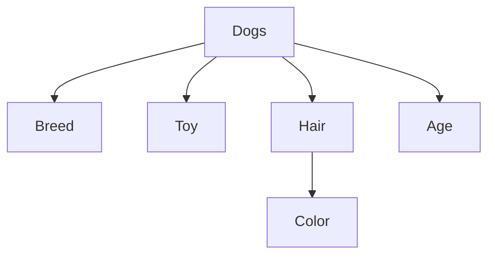

# Schema Engineering for Structured Generation with Pydantic

## Building Reproducible LLM Applications


This article continues our series on using large language models (LLMs) for structured generation. Our previous post showed how to get structured outputs in two consecutive steps:

1. schemas (i.e., constraints that we want to impose on the LLM outputs) are defined and passed to a model, as a way to
"manipulate" its text decoding algorithm;
2. the text produced by the LLM is processed to ensure that it respects the given constraints.

So far, we put both points into practice with schemas in different formats: JSON, YAML, and Python dictionaries. 
Now, we take this approach a bit further with the Pydantic Python library. We will start by lingering on output schemas, as tools that guide the LLM text generation process, to then focus on why and how schema definition and data validation can be conveniently performed with Pydantic.

**Enrica Troiano¹ and Tommaso Furlanello¹²**

¹ HK3Lab
² Tribe AI

**Correspondence:** {name}.{surname}@hk3lab.ai

___
You can find the raw markdown file for the post and the complete code for the examples in our [github repository](https://github.com/HK3-Lab-Team/StructuredGenTutorial). To run the code yourself, simply clone the repository and execute the Jupyter notebook [pydantic_schemas.ipynb](https://github.com/HK3-Lab-Team/StructuredGenTutorial/blob/main/notebooks/pydantic-schemas.ipynb).
___


## Things to Consider When Writing Schemas

In structured generation, like in any other approach, the natural language questions we ask a LLM should be focused and well-posed. Luckily, however, we no longer need to worry that small variations in prompt wording will make or break the quality of the outputs. 
That quality depends on the schema we give the LLMs. 

So, what constitutes a good schema? Attempting a definite answer would be pointless here, because schemas depend on the task at hand and are arbitrarly determined by the LLMs users, but we can still outline some high-level desiderata.


### Structural Constraints, Typological Constraints, and Others

In the realm of LLMs, schemas act as templates for text generation. Therefore, we will start by thinking about the features we'd like to find (or don't want to find) in the LLM answers to ''backpropagate'' those requirements into schema design.

Imagine we wanted to use a LLM to extract dates and company names from text. Naturally, the model might produce a string like `unstructured_answer` below, which is not ideal. It requires handcrafted and potentially complex rules to extrapolate date and company names from unstructured text. 
```python
our_input = f"Using this {schema}, extract company name and date from: Apple Inc. was founded on April 1, 1976."

# output difficult to parse, requires rules to extract target information
unstructured_answer = "All right, understood. The company in question is Apple and 1976 would be the founding year. Let me know if I can assist you further."
```


What we aim to obtain is something more similar to `structured_answer`, where information is neatly organized and easy to parse for further processing: the string starts with a left curly bracket, followed by the word "Date", a space, a semicolon, a string indicating an year and so on. For this reason,
it can be loaded into a dictionary.


```python

# output easier to parse but not yet ideal
structured_answer = "{Date: nineteenseventysix, Company: \n}"
parsed_answer = {
  "Date": "nineteenseventysix", 
  "Company":"\n"
  }
``` 

Still, `structured_answer` is not quite ideal. While it follows the structural division for "Date" and "Company," it omits an important piece of information (the Company name) and incorrectly represents the other (the Date) as text rather than as an integer. Ideally, no information should be missing from the LLM's response, and all parts should be easily convertible into the correct data types.


The string `parsed_answer` below meets all such criteria: it can be turned into a dictionary where keys represent our target information, values are populated with the corresponding parts of the LLM's answer, and all values are not empty and of the correct data type.


```python
answer_ideal = "{Date: 1976, Company: Apple}"
ideal_parsing = {
                 "Date": 1976, 
                 "Company": "Apple"
                 }
```


Schemas should allow us to achieve this scenario in which the LLM answers are parsed into an object matching our schema, without raising errors. Therefore, like  `json_schema`, they must:
1. have a clear template structure, 
2. contain some typological constraints, 
3. and establish optional rules for the content of the LLM answer.

```python
# An example schema of our expectations
json_schema = {
    "type": "object",
    # We want an object structured into two properties: Date and Company
    "properties": {
        # Date must be an integer, Company a string
        "Date": { "type": "int" },
        "Company": { "type": "string" }
        },
     # Neither can be missing in the LLM's answer
     "required": ["Date","Company"] 
      }
```


### Ease of Schema Definition and Data Validation

Assume now that our model has to return more detailed records about various companies, including the company's founding date, name, departments, and the date of the record as well. For such a task, we could use  `hard_json_schema`.

```python
hard_json_schema = {
  "type": "object",
  "properties": {
    "records": {
      "type": "array",
      "items": {
        "type": "object",
        "properties": {
          "Date": { "type": "integer" },
          "Company": {
            "type": "object",
            "properties": {
                "name": { "type": "string" },
                "founded": { "type": "integer" },
                "departments": {
                  "type": "array",
                  "items": { "type": "string"}
                  }
            },
            "required": ["name", "founded", "departments"]
            }
          },
          "required": ["Date", "Company"]
          }
        }
  },
  "required": ["records"]
}
```


This example shows that the expression of schemas in terms of JSON objects (but for that matter, also YAML objects and dictionaries) can be inconveninent.
Schemas are difficult to write for complex tasks, and the code becomes chaotic if we introduce nested structures. Note indeed that `hard_json_schema` is much more convoluted y than `json_schema`, in spite of them serving very similar tasks.

Most importantly, after passing a schema to a model, one can only hope that the answers' types and the additional custom rules are respected. But to know they actually are, we must (try to) parse them, to compare what we obtained with what we expected. 

```python
our_input = f"Using this {hard_json_schema}, extract information from the following text: ..."

# Date can't be converted into integer
structured_answer = "{records : {Date: twentytwenty, ..."# rest of the LLM answer

```


This strategy for data validation is inefficient when working with substantial amounts of data, because it requires us to inspect the answers of LLMs, eventually catch mistakes, and implement solutions to resolve them. 

How can we make our approach more robust? By using Pydantic, a Python library (with over 70M downloads per week!) that offers powerful tools to simplify both the __representation__ of schemas and __validation__ of LLM-produced data. You can install it with the following command in your terminal:

```bash
pip install pydantic==2.9.1
```

## Why Using Pydantic?


Pydantic facilitates the achievement of all schema desiderata we have outlined so far.

|| Desiderata| Using Pydantic |
|---------|----------|----------|
|  (1) | clear structure  |   schemas have fields   |  
|  (2) |typological constraints  |   using type hints   |  
|  (3)  |additional rules  |   custom validators   |  
|  (4)  |ease in schema definition  |   schemas defined as classes   |  
|  (5) |ease in validation  |   data validation based on type hints and custom validators   |  


For starters, it enables us to define schemas as classes comprising one or more fields, where we specify (1) the structure we expect from the LLM outputs, (2) type hints, and (3) custom validators for the data that will populate those fields. 


Here's the real catch. Pydantic automatically converts Python classes into JSON schemas to feed our LLMs, which means that we can write very complex schemas as user-friendly Python objects instead of JSON objects (4). Moreover, 
it adds a layer of guarantee that we won't end up with incorrect data formats: Pydantic performs data validation according to our data type and custom constraints, catching errors before we find them in the LLM's outputs (5). 

In other words, this library handles much of the heavy lifting for us, because it makes the LLM's answers less likely to jailbreaking. So let’s familiarize ourselves with the basics before integrating Pydantic into our LLM calls. 


## Writing Schemas in Pydantic


As an exercise, we’ll define a schema to guide an LLM in extracting relevant information about dogs from text. To keep it simple, we’ll focus on capturing key details like the dog’s name, breed, favorite toy, age, and hair characteristics (type and color).

<br>
<div style="text-align: center;"> <strong>A visualization of the schema.</strong>


<br>
</div>


In Pydantic, a schema is a class that inherits from `pydantic.BaseModel`. It has some fields, and each field has to be associated with a data type. In the following example, the schema `Dogs` has the fields `breed` and `toy`, which are both strings. Bella is an instance of that class.

```python
from pydantic import BaseModel

# Our first schema
class Dogs(BaseModel):
    breed: str
    toy: str

# An instance
Bella = Dogs(breed = "Poodle", toy = "ball")
```

Sometimes, we might need to create more complex schemas with nested structures. For instance, we can have the `Dogs` class use the `Hair` class. That way, every instance of `Dogs` will reference one of the possible values defined in `Hair`.

```python
from typing import Literal, Optional
from enum import Enum

class Hair(Enum):
    Curly = "curly"
    Straight = "straight"
    Shaved = "hairless"

class Dogs(BaseModel):
    breed: str
    toy: str
    hair: Hair
    color: Optional[Literal["brown", "white"]]
```

Note that we've also introduced two new types of data here, `Enum` and `Literal`. `Enum` is useful when we need a set of constants that we can easily iterate over if necessary; `Literal` is ideal for a small sets of values that we don't need to group or iterate over. In this case, it is an `Optional` field. 

In general, types are important in Pydantic because they allow to automatically validate the data. So for instance, Pydantic confirms that Bella is an instance of the schema while Charlie is not, since its `toy` is not a string and the value of its `color` is not allowed in our schema.

```python
Bella = Dogs(breed = "Poodle", toy = "ball", hair = Hair.Curly)
Charlie = Dogs(breed = "Corgi", toy = 12, hair = Hair.Straight, color = "red")

---------------------------------------------------------------------------
ValidationError: 2 validation errors for Dogs
toy
  Input should be a valid string
color
  Input should be `brown` or `white`
```

So far, the Pydantic object `Dog` is an object with two of our desiderata, as it 
1. has a clear structure  
2. contains typological constraints. 

What if we also had custom rules to include in the schema? They can be included with the function `Field`. 

This function allows you to set default values for individual fields in a BaseModel, as well as providing additional metadata (useful for documentation or other processing) or validation constraints (like minimum and maximum values, string length limits, and more). 

```python
# Add inside your Dogs class
age: int = Field(default=1, gt=0, description="Age must be greater than 0")
```

We can actually reach a similar goal by defining custom validators with the `@field_validator` and `@model_validator` decorators provided by Pydantic. While `Field` is useful for straightforward validation of basic constraints, validators offer much more flexibility and power.

```python
from pydantic import Field, field_validator, model_validator

class Dogs(BaseModel):
    breed: str = Field(description="The name of an existing breed")
    toy: str = Field(max_length=50)
    hair: Hair = Field(description="The hair type of the dog")
    color: Optional[Literal["brown", "white"]] = Field(default=None)
    age: int = Field(default=1, gt=0, description="Age must be greater than 0")
    
    @field_validator('breed')
    def check_name(cls, value):
        if any(char in value for char in "!@#^*"):
            raise ValueError('Breed cannot contain special characters')
        return value
 
Coco = Dogs(breed = "Beagle!", toy = "socks", hair = Hair.Curly, age = 1)

---------------------------------------------------------------------------
ValidationError: 1 validation error for Dogs
breed
  Value error, Breed cannot contain special characters
```

Custom validators can be also be used to perform cross-field validation, where one field's value depends on another.

```python
    # Adding a new cross-field validator to the Dogs class
    @model_validator(mode='before')
    def check_hair_and_color(cls, values):
        hair = values.get('hair')
        color = values.get('color')
        
        # If hair is shaved, color can be None or absent
        if hair == Hair.Shaved and color is not None:
            raise ValueError("Dogs with shaved hair should not have a color.")
        
        # If hair is curly or straight, color must be specified and cannot be None
        if hair in {Hair.Curly, Hair.Straight} and color is None:
            raise ValueError("Dogs with curly or straight hair must have a color.")
        
        return values
        
Coco = Dogs(breed = "Beagle", toy = "socks", hair = Hair.Curly, age = 1)

---------------------------------------------------------------------------
ValidationError: 1 validation error for Dogs
Value error, Dogs with curly or straight hair must have a color.
```

Note that now we're using the `mode='before'` argument, which runs the validation before the fields are actually populated. Should we set it to `mode='after'`, the data would be validated after Pydantic has parsed and processed it. This is useful when we want to apply our custom check on the final values of some operations, potentially after type conversions.

Just so we can appreciate how convenient this approach is, let's now have a look at the JSON object corresponding to the `Dogs` class.

```json
{
  "$defs": {
    "Hair": {
      "enum": ["curly", "straight", "shaved"],
      "title": "Hair",
      "type": "string"
    }
  },
  "properties": {
    "breed": {
      "description": "The name of an existing breed",
      "title": "Breed",
      "type": "string"
    },
    "toy": {
      "maxLength": 50,
      "title": "Toy",
      "type": "string"
    },
    "hair": {
      "$ref": "#/$defs/Hair",
      "description": "The hair type of the dog"
    },
    "color": {
      "anyOf": [
        {
          "enum": ["brown", "white"],
          "type": "string"
        },
        {
          "type": "null"
        }
      ],
      "default": null,
      "title": "Color"
    },
    "age": {
      "default": 1,
      "description": "Age must be greater than 0",
      "exclusiveMinimum": 0,
      "title": "Age",
      "type": "integer"
    }
  },
  "required": ["breed", "toy", "hair"],
  "title": "Dogs",
  "type": "object"
}
```

In summary, with a few Pydantic classes we can easily define complex schemas and validators. When combined with LLMs, the schemas serve as templates that the outputs should comply with, while the built-in and custom validators catch any potential output errors, preventing issues before they affect our applications.


## A Workflow with Pydantic

1. Define Schemas
We add rules and constraints, so that  Pydantic will be able to detect potential errors at runtime, which is a lot safer to work with.

2. Set Environment
3. Validate
 Missing: validation with context
E.g., validate that clauses are part of paragraph

We add paragraph to outputs


### NOTE: 
At the end, note that Pydantic is integraetd with various libraries to call LLMs. We have done that with Anthropic but we can do that with others.
