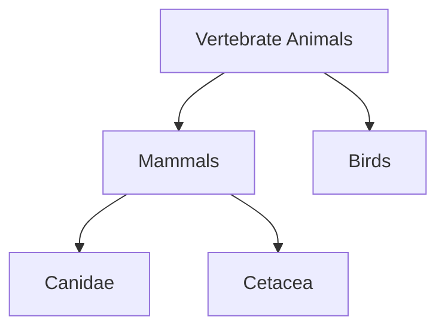

# Schema Engineering for Structured Generation with Pydantic

## Building Reproducible LLM Applications


This blog post is a follow-up to our introduction to structured generation. Using Anthropic's Claude API, we showed how to get structured LLM data, where information is neatly organized and easy to extract, instead of an unstructured sequence of token in two steps:

1. defining schemas (i.e., abstractions our preferred structural and typological constraints for the LLM outputs) to pass to a model to
"manipulate" its text decoding algorithm,
2. we validate and process the LLM outputs with those schemas.

Previously, we demonstrated this approach using data formats like JSON, YAML, and Python dictionaries. Now, we take it a step further by introducing a Python library that simplifies both schema definition and validation: Pydantic.

**Enrica Troiano¹ and Tommaso Furlanello¹²**

¹ HK3Lab
² Tribe AI

**Correspondence:** {name}.{surname}@hk3lab.ai


## Schema Engineering

That means that more than brushing up our prompts in natural language, we care about how to spell out our expectations in formal terms. Obviously, posing the right questions still remains important, but we can stop worrying that minimal variations in the words we choose will impact the quality of the LLM's answers, that quality will mostly be influenced by the output schemas we use. 

__representing__ and __validate__ data structures, i.e. our schemas.

 It would be ideal, for instance, if the LLM's output strings could be parsed into dictionaries. Keys would represent the structure we desire, and values could be populated with (parts of) the LLM's answers.

```python
# input
our_prompt = "Extract company name and the year from: Apple Inc. was founded on April 1, 1976."

# output difficult to process
llm_answer_unstructured = "Got it! In the sentence «Apple Inc. was founded on April 1, 1976.», the company is Apple, and the year when it was founded is 1976. Let me know if you have further questions."

# ideal output
llm_answer_structured = "{Date: 1976, Company: Apple}"

# what we want to achieve after parsing the output
parsed_answer = {
                 "Date": 1976, 
                 "Company": "Apple"
                 }
```

Parsed answers should have no missing values, and all values should be of the right data type.

```python
# WHAT WE DON'T WANT

# date won't be parsed into an integer
# and company is not there
llm_answer = "{Date: nineteenseventysix, Company: \n}"
```

ciao

```python
# WHAT WE MIGHT COMMUNICATE TO THE MODEL

# a schema of our preferred constraints, to incorporate in the LLM call 
desired_json_schema = {
    "type": "object",
    # We want an object structured into two properties: Date and Company
    "properties": {
        # Date must be an integer, Company a string
        "Date": { "type": "int" },
        "Company": { "type": "string" }
        },
     # Neither can be missing in the LLM's answer
     "required": ["Date","Company"] 
      }
```

Here's the catch of this strategy: communicating a JSON object to the models limits their possible response tokens to those sequences that follow the schema. As a result, we get answers that are more likely parsable into a dictionary matching that schema, i.e., with keys and values that correspond to the schema's properties. For example, `desired_json_schema` can entice a language model to produce `llm_answer_structured`, namely, a string that starts with a left curly bracket, followed by the word "Date", a space, a semicolon, a number and so on, which we can load into `parsed_answer`.




### FROM JSON OBJECTS TO PYTHON OBJECTS

Although useful, the expression of schemas in terms of JSON objects is troublesome. Imagine if we wanted a model to return detailed records about various companies, including the company's founding date, name, and the departments within each company. Additionally, we would want these records to be structured in a way that includes the date of the record as well. The schema for such a task could look something like this -- compare it to `desired_json_schema` seen earlier, and note how much more complex and user-unfriendly it is.

```python
desired_json_schema = {
    "type": "object",
     "properties": {
        "records": {
           "type": "array",
            "items": {
               "type": "object",
                "properties": {
                    "Date": { "type": "integer" },
                    "Company": {
                        "type": "object",
                        "properties": {
                            "name": { "type": "string" },
                            "founded": { "type": "integer" },
                            "departments": {
                                "type": "array",
                                "items": {
                                    "type": "string"
                                }
                            }
                        },
                        "required": ["name", "founded", "departments"]
                    }
                },
                "required": ["Date", "Company"]
            }
        }
    },
    "required": ["records"]
}
```

In fact, working with JSON can actually be troublesome for users, because schemas are difficult to write for complex tasks, and the code becomes chaotic as soon as we introduce nested structures. Most importantly, after passing a schema to the model, one can only hope that the answers' types will be ok. But to know they actually are, we must (try to) parse them back in a dictionary that matches the JSON object we defined, so we can compare what we obtained with what we expected. This strategy for data validation is highly inefficient when working with substantial amounts of data, because it requires us to inspect the answers of LLMs, eventually catch mistakes, and implement solutions to resolve them. We want our approach to be more robust than that.

A solution is the use of Pydantic, a powerful Python library (with over 70M downloads per week!) that gives us the possibility to model data as Python objects instead of JSON schemas. Pydantic enables us to define data structures with type hints. It automatically converts these structures into JSON schemas, and it performs type checking for data validation, catching errors before we find them in the LLM's outputs. In other words, Pydantic handles much of the heavy lifting for us, because it makes the LLM's answers less likely to jailbreaking, and adds a layer of guarantee that we won't end up with incorrect data formats. So let's familiarize ourselves with the basics of this library, before we integrate it within our LLMs calls.

## PYDANTIC AS A TOOLKIT TO DEFINE SCHEMAS

Install the library with the following command in your terminal.

```bash
pip install pydantic==2.9.1
```

In Pydantic, a schema is a class that inherits from `pydantic.BaseModel`. It has some fields, and each field has to be associated with a data type. In the following example, `Dogs` has the fields `breed` and `toy`, which are both strings. Bella is an instance of that class.

```python
from pydantic import BaseModel

# Our first schema
class Dogs(BaseModel):
    breed: str
    toy: str

# An instance
Bella = Dogs(breed = "Poodle", toy = "ball")
```

Sometimes, we might need to create more complex schemas with nested structures. For instance, we can have the Dogs class use the Hair class. That way, every instance of Dogs will reference one of the possible values defined in Hair.

```python
from typing import Literal, Optional
from enum import Enum

class Hair(Enum):
    Curly = "curly"
    Straight = "straight"
    Shaved = "hairless"

class Dogs(BaseModel):
    breed: str
    toy: str
    hair: Hair
    color: Optional[Literal["brown", "white"]]
```

Note that we've introduced two new types of data here, `Enum` and `Literal`. `Enum` is useful when we need a set of constants that we can easily iterate over if necessary; `Literal` is ideal for a small sets of values that we don't need to group or iterate over. In this case, it is an `Optional` field. Types are important because they allow to automatically validate the data and detect potential errors at runtime, a lot safer to work with. So for instance, Pydantic confirms that Bella is an instance of the schema while Charlie is not, since its `toy` is not a string and the value of its `color` is not allowed in our schema.

```python
Bella = Dogs(breed = "Poodle", toy = "ball", hair = Hair.Curly)
Charlie = Dogs(breed = "Corgi", toy = 12, hair = Hair.Straight, color = "red")

---------------------------------------------------------------------------
ValidationError: 2 validation errors for Dogs
toy
  Input should be a valid string
color
  Input should be `brown` or `white`
```

If needed, you can also define custom rules for validation with the function `Field`. This function allows you to set default values for individual fields in a BaseModel, as well as providing additional metadata (useful for documentation or other processing) or validation constraints (like minimum and maximum values, string length limits, and more). 

```python
# Add inside your Dogs class
age: int = Field(default=1, gt=0, description="Age must be greater than 0")
```

We can actually reach a similar goal by defining custom validators with the `@field_validator` and `@model_validator` decorators provided by Pydantic. While `Field` is useful for straightforward validation of basic constraints, validators offer much more flexibility and power.

```python
from pydantic import Field, field_validator, model_validator

class Dogs(BaseModel):
    breed: str = Field(description="The name of an existing breed")
    toy: str = Field(max_length=50)
    hair: Hair = Field(description="The hair type of the dog")
    color: Optional[Literal["brown", "white"]] = Field(default=None)
    age: int = Field(default=1, gt=0, description="Age must be greater than 0")
    
    @field_validator('breed')
    def check_name(cls, value):
        if any(char in value for char in "!@#^*"):
            raise ValueError('Breed cannot contain special characters')
        return value
 
Coco = Dogs(breed = "Beagle!", toy = "socks", hair = Hair.Curly, age = 1)

---------------------------------------------------------------------------
ValidationError: 1 validation error for Dogs
breed
  Value error, Breed cannot contain special characters
```

Custom validators can be also be used to perform cross-field validation, where one field's value depends on another.

```python
    # Adding a new cross-field validator to the Dogs class
    @model_validator(mode='before')
    def check_hair_and_color(cls, values):
        hair = values.get('hair')
        color = values.get('color')
        
        # If hair is shaved, color can be None or absent
        if hair == Hair.Shaved and color is not None:
            raise ValueError("Dogs with shaved hair should not have a color.")
        
        # If hair is curly or straight, color must be specified and cannot be None
        if hair in {Hair.Curly, Hair.Straight} and color is None:
            raise ValueError("Dogs with curly or straight hair must have a color.")
        
        return values
        
Coco = Dogs(breed = "Beagle", toy = "socks", hair = Hair.Curly, age = 1)

---------------------------------------------------------------------------
ValidationError: 1 validation error for Dogs
Value error, Dogs with curly or straight hair must have a color.
```

Note that now we're using the `mode='before'` argument, which runs the validation before the fields are actually populated. Should we set it to `mode='after'`, the data would be validated after Pydantic has parsed and processed it. This is useful when we want to apply our custom check on the final values of some operations, potentially after type conversions.

Just so we can appreciate how convenient this approach is, let's now have a look at the JSON object corresponding to the `Dogs` class.

```json
{
  "$defs": {
    "Hair": {
      "enum": ["curly", "straight", "shaved"],
      "title": "Hair",
      "type": "string"
    }
  },
  "properties": {
    "breed": {
      "description": "The name of an existing breed",
      "title": "Breed",
      "type": "string"
    },
    "toy": {
      "maxLength": 50,
      "title": "Toy",
      "type": "string"
    },
    "hair": {
      "$ref": "#/$defs/Hair",
      "description": "The hair type of the dog"
    },
    "color": {
      "anyOf": [
        {
          "enum": ["brown", "white"],
          "type": "string"
        },
        {
          "type": "null"
        }
      ],
      "default": null,
      "title": "Color"
    },
    "age": {
      "default": 1,
      "description": "Age must be greater than 0",
      "exclusiveMinimum": 0,
      "title": "Age",
      "type": "integer"
    }
  },
  "required": ["breed", "toy", "hair"],
  "title": "Dogs",
  "type": "object"
}
```

In summary, with a few Pydantic classes we can easily define complex schemas and validators. When combined with LLMs, the schemas serve as templates that the outputs should comply with, while the built-in and custom validators catch any potential output errors, preventing issues before they affect our applications.

### NOTE: 
At the end, note that Pydantic is integraetd with various libraries to call LLMs. We have done that with Anthropic but we can do that with others.